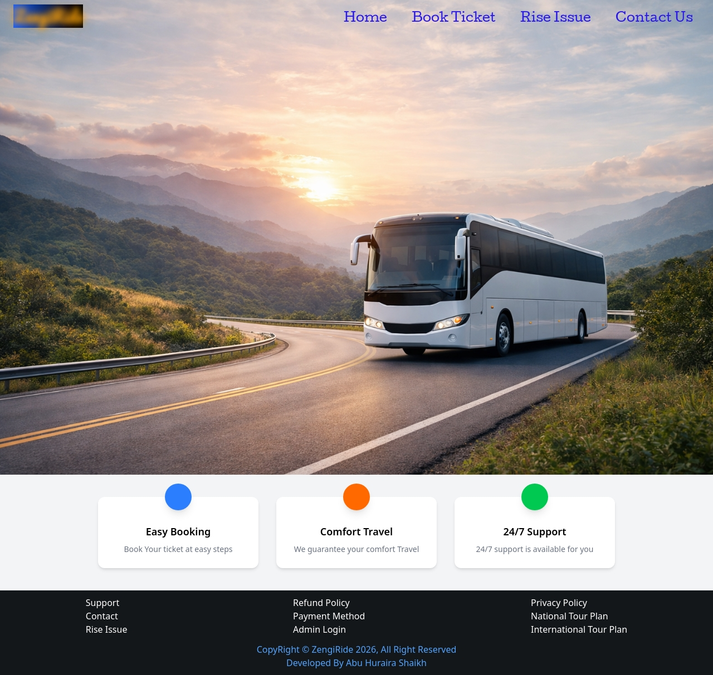

<h1 align="center">🚌 ZengiRide - Bus Booking Website</h1>

  

  
  
  
  

---

<h2>📌 Overview</h2>

ZengiRide is a frontend-based bus booking web application that allows users to book tickets,
raise issues, and interact with an admin dashboard. It is designed as a clean and beginner-friendly project
to demonstrate real-world UI logic and user interaction.

---

<h2>🚀 Features</h2>
<ul>
  <li>🎫 Easy Ticket Booking System</li>
  <li>🧾 Auto Ticket ID Generation</li>
  <li>⚠️ Issue Raising System</li>
  <li>🖨️ Print Ticket Option</li>
  <li>📊 Admin Dashboard (Counts + Details)</li>
  <li>📨 Contact Form (Formspree Integration)</li>
</ul>

---

<h2>🗂️ Project Structure</h2>
<pre>
busTicket/
│
├── src/
│   ├── index.html
│   ├── bookTicket.html
│   ├── issue.html
│   ├── contact.html
│   ├── admin.html
│   ├── bookTicket.js
│   ├── issue.js
│   ├── admin.js
│   ├── input.css
│   ├── output.css
│   └── photo/
│
├── package.json
└── package-lock.json
</pre>

---

<h2>⚙️ How It Works</h2>
<ul>
  <li>User books a ticket → Data stored in array (frontend state)</li>
  <li>User raises an issue → Stored in another array</li>
  <li>Admin panel displays counts and lists dynamically</li>
</ul>

---

<h2>🧪 Technologies Used</h2>
<ul>
  <li>HTML5</li>
  <li>Tailwind CSS v4.2</li>
  <li>Vanilla JavaScript</li>
</ul>

---

<h2>📄 Pages</h2>
<ul>
  <li>🏠 Home Page</li>
  <li>🎫 Book Ticket</li>
  <li>⚠️ Raise Issue</li>
  <li>📞 Contact Page</li>
  <li>📊 Admin Dashboard</li>
</ul>

---

<h2>🌐 Live Demo</h2>

👉 <a href="https://zengiride.netlify.app/" target="_blank">View Live Project</a>

---

<h2>⚠️ Note</h2>

This is a frontend-only project. Data is not stored permanently.
Backend integration can be added in the future to make it fully functional.

---

<h2>👨‍💻 Author</h2>

Abu Huraira Shaikh

  ⭐ If you like this project, consider giving it a star!

